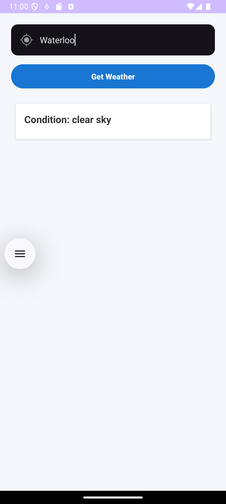
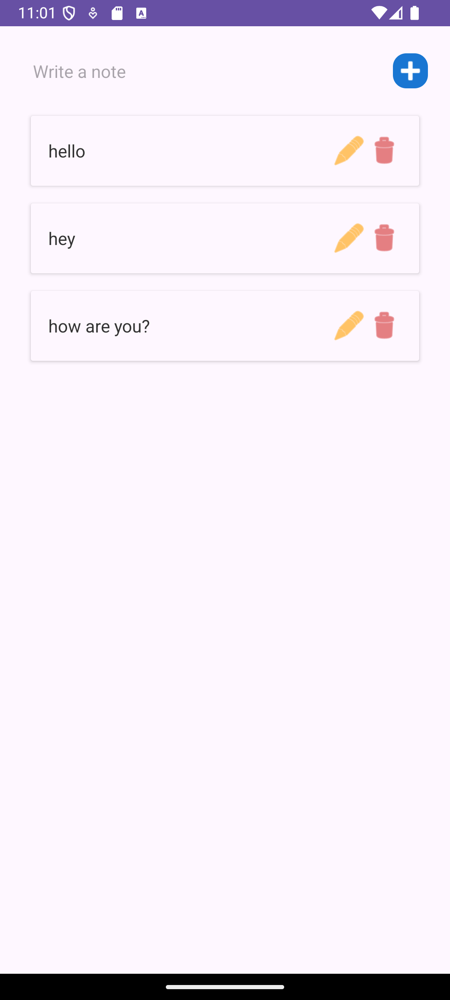

# 📱 LifeTracker

**LifeTracker** is a modern productivity and utility Android app built in **Kotlin** that combines real-time weather updates, location tracking, persistent note saving, theme preferences, and dynamic lists. This project was developed as part of the **DevOps for Cloud Computing** program at Conestoga College.

[🔗 GitHub Repository](https://github.com/dhruvjivani/LifeTracker)

---

## ✨ Features

- 🌤 **Weather Info via API**
  - Fetch current weather for any city using OpenWeatherMap API
  - Dynamic card-based layout using RecyclerView
  - Handles errors (e.g., empty response, no internet)

- 📝 **Notes Storage (SQLite)**
  - Add, edit, and delete notes
  - Real-time updates in RecyclerView
  - Uses `CardView` for a clean UI

- 📍 **Location Tracking**
  - Displays current latitude and longitude
  - Auto updates when permissions granted
  - Graceful fallback if location is unavailable

- 🌓 **Dark Mode**
  - Toggle between Light and Dark themes
  - Preference saved using SharedPreferences

---

## 📸 Screenshots

| 🟦 Weather Info | 🟨 Saved Notes | 🟩 Location Screen |
|----------------|----------------|-------------------|
|  |  |  |

---

## 🧪 Unit Testing

- ✅ `testInsertNote()` — Verifies SQLite insert logic.
- ✅ `testUpdateNote()` — Confirms update logic works.
- ✅ `testParseWeatherJson()` — Tests JSON parsing from API.

---

## 🐞 Debugging Summary

| Bug ID | Issue                                | Fix Applied                           |
|--------|--------------------------------------|----------------------------------------|
| 1      | Crash on null weather response       | Used `?: emptyList()` fallback         |
| 2      | Misleading label in UI               | Updated label text                     |
| 3      | Crash on empty note input            | Added input validation check           |

---

## 🚀 Run Instructions

1. Clone the repository  
   `git clone https://github.com/dhruvjivani/LifeTracker`

2. Open in Android Studio

3. Add your API key in `WeatherActivity.kt`  
   ```kotlin
   api.getWeather(city, "YOUR_API_KEY")
   ```

4. Run on emulator or real device

---

## 👩‍💻 Author

**Dhruv Jivani**  
Mobile and web development | Conestoga College  
📍 Canada  
🔗 [GitHub](https://github.com/dhruvjivani)

---

## 📝 License

This project is for educational use under Conestoga College's academic policy.
